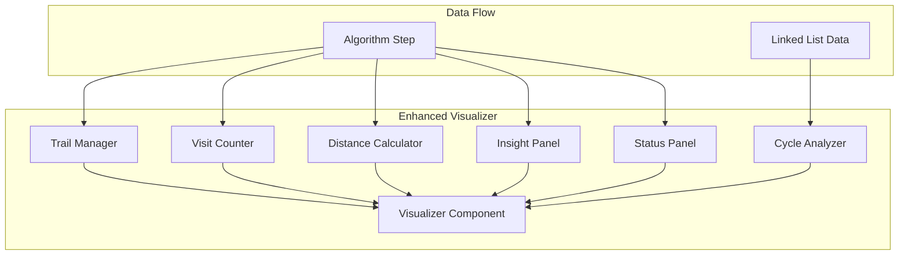

# Design Document

## Overview

本设计文档描述了 LeetCode 141 环形链表可视化器的画布信息增强功能。通过增加指针轨迹、访问统计、距离指示器、算法原理提示等信息，提高画布的信息密度，帮助用户更好地理解快慢指针算法。

## Architecture



## Components and Interfaces

### 1. Trail Manager

管理指针移动轨迹的记录和渲染。

```typescript
interface TrailManager {
  slowTrail: number[];      // 慢指针经过的节点索引
  fastTrail: number[];      // 快指针经过的节点索引
  
  recordSlowVisit(nodeIndex: number): void;
  recordFastVisit(nodeIndex: number): void;
  getTrailIntensity(nodeIndex: number, pointer: 'slow' | 'fast'): number;
  reset(): void;
}

interface TrailRenderConfig {
  slowColor: string;        // 慢指针轨迹颜色 (带透明度)
  fastColor: string;        // 快指针轨迹颜色 (带透明度)
  baseOpacity: number;      // 基础透明度
  intensityMultiplier: number; // 重复访问时的强度增量
}
```

### 2. Visit Counter

统计每个节点被各指针访问的次数。

```typescript
interface VisitCounter {
  slowVisits: Map<number, number>;  // 节点索引 -> 慢指针访问次数
  fastVisits: Map<number, number>;  // 节点索引 -> 快指针访问次数
  
  incrementSlowVisit(nodeIndex: number): void;
  incrementFastVisit(nodeIndex: number): void;
  getSlowVisitCount(nodeIndex: number): number;
  getFastVisitCount(nodeIndex: number): number;
  isRevisited(nodeIndex: number): boolean;
  reset(): void;
}
```

### 3. Distance Calculator

计算快慢指针之间的距离。

```typescript
interface DistanceCalculator {
  calculateLinearDistance(slowPos: number, fastPos: number): number;
  calculateCycleAwareDistance(
    slowPos: number, 
    fastPos: number, 
    cyclePos: number, 
    totalNodes: number
  ): CycleDistance;
}

interface CycleDistance {
  forwardDistance: number;    // 正向距离
  cycleDistance: number;      // 环内距离 (如果适用)
  isInCycle: boolean;         // 是否在环内
}
```

### 4. Insight Panel

显示算法原理解释。

```typescript
interface InsightPanel {
  currentPhase: AlgorithmPhase;
  insights: Map<AlgorithmPhase, InsightContent>;
  
  updatePhase(phase: AlgorithmPhase): void;
  getInsight(): InsightContent;
  toggleCollapsed(): void;
}

type AlgorithmPhase = 
  | 'initialization'
  | 'moving'
  | 'meeting'
  | 'no-cycle'
  | 'completed';

interface InsightContent {
  title: string;
  explanation: string;
  formula?: string;
}
```

### 5. Cycle Analyzer

分析环形结构的属性。

```typescript
interface CycleAnalyzer {
  analyze(values: number[], cyclePos: number): CycleInfo;
}

interface CycleInfo {
  hasCycle: boolean;
  cycleLength: number;        // 环的长度
  tailLength: number;         // 尾部长度 (环入口前的节点数)
  cycleNodes: number[];       // 环内节点的索引
  tailNodes: number[];        // 尾部节点的索引
}
```

### 6. Status Panel

显示实时算法状态。

```typescript
interface StatusPanel {
  slowPosition: number;
  slowValue: number | null;
  fastPosition: number;
  fastValue: number | null;
  loopCondition: string;
  loopConditionResult: boolean;
  iterationCount: number;
  speedRatio: string;
  
  update(step: AlgorithmStep): void;
  render(): void;
}
```

## Data Models

### Enhanced Algorithm Step

```typescript
interface EnhancedAlgorithmStep extends AlgorithmStep {
  // 继承原有属性
  stepNumber: number;
  codeLine: number;
  slowPos: number;
  fastPos: number;
  variables: VariableState[];
  description: string;
  hasCycle: boolean | null;
  
  // 新增属性
  phase: AlgorithmPhase;
  iterationCount: number;
  loopCondition: {
    expression: string;
    result: boolean;
  };
}
```

### Visualizer State

```typescript
interface EnhancedVisualizerState {
  // 基础状态
  nodes: ListNode[];
  cyclePos: number;
  slowPos: number;
  fastPos: number;
  
  // 增强状态
  trailManager: TrailManager;
  visitCounter: VisitCounter;
  cycleInfo: CycleInfo;
  currentPhase: AlgorithmPhase;
  distance: CycleDistance;
}
```

## Correctness Properties

*A property is a characteristic or behavior that should hold true across all valid executions of a system-essentially, a formal statement about what the system should do. Properties serve as the bridge between human-readable specifications and machine-verifiable correctness guarantees.*

### Property 1: Pointer Trail Completeness

*For any* sequence of algorithm steps, the trail manager SHALL contain all node indices that each pointer has visited, in the order they were visited.

**Validates: Requirements 1.1, 1.2**

### Property 2: Trail Color Distinction

*For any* visualizer state, the slow pointer trail color SHALL be different from the fast pointer trail color.

**Validates: Requirements 1.3**

### Property 3: Trail Intensity Monotonicity

*For any* node that has been visited multiple times by a pointer, the trail intensity SHALL be greater than or equal to the intensity of a node visited fewer times.

**Validates: Requirements 1.4**

### Property 4: Visit Count Accuracy

*For any* sequence of pointer movements, the visit count for each node SHALL equal the exact number of times that pointer has visited that node.

**Validates: Requirements 2.1, 2.2**

### Property 5: Visit Count Reset Completeness

*For any* visualizer state after reset, all visit counts for all nodes SHALL be zero.

**Validates: Requirements 2.4**

### Property 6: Distance Calculation Correctness

*For any* two pointer positions in a linked list, the calculated distance SHALL equal the actual number of nodes between them (considering cycle if applicable).

**Validates: Requirements 3.1, 3.4**

### Property 7: Cycle Structure Calculation

*For any* linked list with a cycle at position `pos`, the cycle analyzer SHALL correctly calculate:
- cycleLength = totalNodes - pos
- tailLength = pos
- cycleNodes contains exactly the indices from pos to totalNodes-1

**Validates: Requirements 6.1, 6.2, 6.3**

### Property 8: Status Panel State Consistency

*For any* algorithm step, the status panel SHALL display values that exactly match the step's slowPos, fastPos, and their corresponding node values.

**Validates: Requirements 7.1, 7.2**

### Property 9: Iteration Count Accuracy

*For any* algorithm execution, the iteration count SHALL equal the number of times the while loop body has been executed.

**Validates: Requirements 7.4**

### Property 10: Speed Ratio Correctness

*For any* algorithm execution where slow pointer has moved N times, the fast pointer SHALL have moved approximately 2N times (within the bounds of the algorithm logic).

**Validates: Requirements 5.3**

## Error Handling

### Edge Cases

1. **Empty Trail**: When no steps have been executed, trails should be empty arrays.
2. **Single Node List**: Distance calculation should handle single-node lists correctly.
3. **No Cycle**: Cycle analyzer should return cycleLength=0 and tailLength=totalNodes when no cycle exists.
4. **Pointer at Null**: When fast pointer reaches null, display "null" instead of a position.

### UI Graceful Degradation

1. **Panel Overflow**: If too much information, use scrollable panels.
2. **Small Screen**: Hide less critical information on smaller viewports.

## Testing Strategy

### Unit Testing

使用 Jest 进行单元测试：

1. **Trail Manager Tests**
   - Test trail recording for various step sequences
   - Test intensity calculation for repeated visits
   - Test reset functionality

2. **Visit Counter Tests**
   - Test increment operations
   - Test separate tracking for slow/fast pointers
   - Test reset functionality

3. **Distance Calculator Tests**
   - Test linear distance calculation
   - Test cycle-aware distance calculation
   - Test edge cases (same position, null pointer)

4. **Cycle Analyzer Tests**
   - Test cycle length calculation
   - Test tail length calculation
   - Test node classification (cycle vs tail)

### Property-Based Testing

使用 fast-check 库进行属性测试，每个测试运行至少 100 次迭代。

每个属性测试必须使用以下格式标注：
`**Feature: canvas-info-enhancement, Property {number}: {property_text}**`

1. **Trail Completeness Property Test**
   - Generate random step sequences
   - Verify all visited nodes are in the trail

2. **Visit Count Property Test**
   - Generate random visit sequences
   - Verify counts match actual visits

3. **Distance Calculation Property Test**
   - Generate random linked lists and pointer positions
   - Verify distance calculations are correct

4. **Cycle Analysis Property Test**
   - Generate random linked lists with/without cycles
   - Verify cycle structure calculations

## UI Layout

```
┌─────────────────────────────────────────────────────────────────┐
│ ┌─────────────────────────────────────────────────────────────┐ │
│ │ 图例: ● 慢指针(slow) ● 快指针(fast) ● 环连接               │ │
│ │ 统计: 慢指针: 3步  快指针: 6步  速度比: 1:2                 │ │
│ │ 距离: 快指针领先 2 个节点                                    │ │
│ └─────────────────────────────────────────────────────────────┘ │
│                                                                 │
│ ┌─────────────────────────────────────────────────────────────┐ │
│ │                    [SVG 链表可视化]                          │ │
│ │   ┌───┐    ┌───┐    ┌───┐    ┌───┐                         │ │
│ │   │ 3 │───▶│ 2 │───▶│ 0 │───▶│-4 │                         │ │
│ │   └───┘    └───┘    └───┘    └───┘                         │ │
│ │   [0]      [1]      [2]      [3]                            │ │
│ │   s:1      s:1 f:2  s:0 f:1  s:0 f:1  (访问次数)            │ │
│ │            环入口    ◀─────────┘ (环连接)                   │ │
│ └─────────────────────────────────────────────────────────────┘ │
│                                                                 │
│ ┌─────────────────────────────────────────────────────────────┐ │
│ │ 📊 算法状态                                                  │ │
│ │ ├─ slow: 位置[1], 值=2                                      │ │
│ │ ├─ fast: 位置[3], 值=-4                                     │ │
│ │ ├─ 循环条件: slow != fast → true                            │ │
│ │ └─ 迭代次数: 2                                              │ │
│ └─────────────────────────────────────────────────────────────┘ │
│                                                                 │
│ ┌─────────────────────────────────────────────────────────────┐ │
│ │ 💡 算法原理 [▼ 展开]                                        │ │
│ │ 快指针每次移动2步，慢指针每次移动1步。                       │ │
│ │ 如果存在环，快指针最终会追上慢指针。                         │ │
│ └─────────────────────────────────────────────────────────────┘ │
│                                                                 │
│ ┌─────────────────────────────────────────────────────────────┐ │
│ │ 🔄 环形结构                                                  │ │
│ │ ├─ 尾部长度: 1 个节点                                       │ │
│ │ ├─ 环长度: 3 个节点                                         │ │
│ │ └─ 环内节点: [1] → [2] → [3] → [1]                          │ │
│ └─────────────────────────────────────────────────────────────┘ │
└─────────────────────────────────────────────────────────────────┘
```

## File Changes

需要修改的文件：

```
src/
├── scripts/
│   ├── visualizer.js        # 增强可视化组件
│   ├── trailManager.js      # 新增：轨迹管理器
│   ├── visitCounter.js      # 新增：访问计数器
│   ├── distanceCalculator.js # 新增：距离计算器
│   ├── cycleAnalyzer.js     # 新增：环形分析器
│   ├── insightPanel.js      # 新增：原理提示面板
│   └── statusPanel.js       # 新增：状态面板
├── styles/
│   └── main.css             # 增强样式
tests/
├── trailManager.test.js     # 新增测试
├── visitCounter.test.js     # 新增测试
├── distanceCalculator.test.js # 新增测试
├── cycleAnalyzer.test.js    # 新增测试
└── properties.test.js       # 属性测试
```

## Technology Stack

- **Visualization**: SVG with vanilla JavaScript (继续使用现有技术)
- **Testing**: Jest + fast-check (继续使用现有技术)
- **Animation**: CSS transitions for smooth updates
