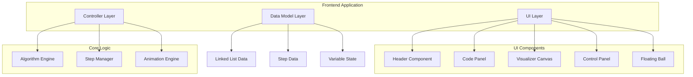

# Design Document

## Overview

本项目是一个基于 Web 的 LeetCode 141 环形链表算法可视化工具。采用纯前端技术栈（HTML/CSS/JavaScript），通过 Canvas 或 SVG 绘制链表图形，实现代码调试效果和交互式控制。项目部署在 GitHub Pages 上，使用 GitHub Actions 实现自动化部署。

## Architecture



## Components and Interfaces

### 1. Header Component

负责页面顶部的标题和导航链接。

```typescript
interface HeaderProps {
  title: string;           // "141. 环形链表"
  leetcodeUrl: string;     // LeetCode 题目链接
  githubUrl: string;       // GitHub 仓库链接
}
```

### 2. Code Panel Component

展示 Java 代码，支持语法高亮和调试效果。

```typescript
interface CodePanelProps {
  code: string;                    // Java 源代码
  currentLine: number;             // 当前执行行号
  variables: VariableState[];      // 变量状态列表
}

interface VariableState {
  name: string;           // 变量名
  value: string;          // 变量值
  line: number;           // 变量所在行号
}
```

### 3. Visualizer Component

使用 SVG 绘制链表可视化。

```typescript
interface VisualizerProps {
  nodes: ListNode[];              // 链表节点数组
  cyclePos: number;               // 环的位置 (-1 表示无环)
  slowPointer: number;            // 慢指针位置
  fastPointer: number;            // 快指针位置
  currentStep: number;            // 当前步骤
  totalSteps: number;             // 总步骤数
  phaseDescription: string;       // 当前阶段描述
}

interface ListNode {
  val: number;
  index: number;
  x: number;
  y: number;
}

// 布局参数 - 增大节点间距以确保环形箭头清晰可见
interface LayoutConfig {
  nodeRadius: number;      // 节点半径: 25px
  nodeSpacing: number;     // 节点间距: 100px (从 80px 增加)
  startX: number;          // 起始 X 坐标: 60px
  startY: number;          // 起始 Y 坐标: 80px
  svgHeight: number;       // SVG 高度: 220px
}
```

### 4. Control Panel Component

控制按钮和快捷键绑定。

```typescript
interface ControlPanelProps {
  onPrevStep: () => void;
  onNextStep: () => void;
  onPlayPause: () => void;
  isPlaying: boolean;
  canGoPrev: boolean;
  canGoNext: boolean;
}

interface KeyboardShortcuts {
  'ArrowLeft': 'prevStep';
  'ArrowRight': 'nextStep';
  'Space': 'playPause';
}
```

### 5. Floating Ball Component

悬浮球和二维码弹窗。

```typescript
interface FloatingBallProps {
  qrCodeImage: string;    // 二维码图片路径
  promptText: string;     // 提示文字
}
```

### 6. Algorithm Engine

算法执行引擎，生成每一步的状态。步骤生成需要细粒度划分，确保每个条件检查、指针移动、循环进入/退出都是独立的步骤。

```typescript
interface AlgorithmStep {
  stepNumber: number;
  codeLine: number;
  slowPos: number;
  fastPos: number;
  variables: VariableState[];
  description: string;
  hasCycle: boolean | null;  // null 表示还未确定
  stepType: StepType;        // 步骤类型，用于细粒度分类
}

// 步骤类型枚举 - 用于细粒度步骤划分
enum StepType {
  METHOD_ENTRY = 'method_entry',           // 方法入口
  CONDITION_CHECK = 'condition_check',     // 条件检查
  VARIABLE_INIT = 'variable_init',         // 变量初始化
  LOOP_ENTRY = 'loop_entry',               // 循环入口
  LOOP_CONDITION = 'loop_condition',       // 循环条件检查
  POINTER_MOVE_SLOW = 'pointer_move_slow', // 慢指针移动
  POINTER_MOVE_FAST = 'pointer_move_fast', // 快指针移动
  LOOP_EXIT = 'loop_exit',                 // 循环退出
  RETURN_RESULT = 'return_result'          // 返回结果
}

interface AlgorithmEngine {
  initialize(head: number[], pos: number): void;
  generateAllSteps(): AlgorithmStep[];
  getStep(index: number): AlgorithmStep;
  getTotalSteps(): number;
}
```

#### 细粒度步骤划分规则

每次循环迭代应包含以下独立步骤：
1. **while 条件检查** - 检查 slow != fast
2. **fast null 检查 (第一部分)** - 检查 fast == null
3. **fast.next null 检查 (第二部分)** - 检查 fast.next == null
4. **慢指针移动** - slow = slow.next
5. **快指针移动** - fast = fast.next.next

这样可以让用户更清晰地理解算法的每一个执行细节。
```

### 7. Step Manager

管理步骤导航和自动播放。

```typescript
interface StepManager {
  currentStep: number;
  totalSteps: number;
  isPlaying: boolean;
  playSpeed: number;       // 毫秒
  
  goToStep(step: number): void;
  nextStep(): void;
  prevStep(): void;
  play(): void;
  pause(): void;
  toggle(): void;
}
```

## Data Models

### Linked List Data Structure

```typescript
interface LinkedListData {
  values: number[];        // 节点值数组 [3, 2, 0, -4]
  pos: number;             // 环的位置，-1 表示无环
}

// 示例数据
const example1: LinkedListData = {
  values: [3, 2, 0, -4],
  pos: 1
};

const example2: LinkedListData = {
  values: [1, 2],
  pos: 0
};

const example3: LinkedListData = {
  values: [1],
  pos: -1
};
```

### Algorithm State

```typescript
interface AlgorithmState {
  steps: AlgorithmStep[];
  currentStepIndex: number;
  linkedList: LinkedListData;
}
```

### Java Code Template

```java
public class Solution {
    public boolean hasCycle(ListNode head) {
        if (head == null || head.next == null) {
            return false;
        }
        ListNode slow = head;
        ListNode fast = head.next;
        while (slow != fast) {
            if (fast == null || fast.next == null) {
                return false;
            }
            slow = slow.next;
            fast = fast.next.next;
        }
        return true;
    }
}
```


## Correctness Properties

*A property is a characteristic or behavior that should hold true across all valid executions of a system-essentially, a formal statement about what the system should do. Properties serve as the bridge between human-readable specifications and machine-verifiable correctness guarantees.*

Based on the prework analysis, the following correctness properties have been identified:

### Property 1: Step-to-Line Mapping Consistency

*For any* algorithm step index within the valid range [0, totalSteps-1], the code panel SHALL highlight exactly the line number specified by that step's `codeLine` property.

**Validates: Requirements 2.2, 2.4**

### Property 2: Variable State Display Consistency

*For any* algorithm step that contains variable state changes, the code panel SHALL display each variable's value inline after its corresponding code line, and the displayed values SHALL match the step's `variables` array.

**Validates: Requirements 2.3**

### Property 3: Step Navigation Correctness

*For any* current step index `n`:
- If `n > 0`, invoking `prevStep()` SHALL result in step index `n-1`
- If `n < totalSteps-1`, invoking `nextStep()` SHALL result in step index `n+1`
- If `n == 0`, the prev button SHALL be disabled
- If `n == totalSteps-1`, the next button SHALL be disabled

**Validates: Requirements 3.1, 3.2, 3.5, 3.6**

### Property 4: Play/Pause Toggle Idempotence

*For any* play state (playing or paused), invoking `toggle()` twice SHALL return to the original state.

**Validates: Requirements 3.3**

### Property 5: Pointer Visualization Distinction

*For any* algorithm step where slow pointer and fast pointer are at different positions, the visualizer SHALL render them with visually distinct markers (different colors or shapes).

**Validates: Requirements 4.2**

### Property 6: Cycle Visualization Correctness

*For any* linked list data where `pos >= 0`, the visualizer SHALL render a visual connection (arrow) from the last node back to the node at index `pos`.

**Validates: Requirements 4.3**

### Property 7: Step Information Completeness

*For any* algorithm step, the visualizer SHALL display:
- Current step number (1-indexed for user display)
- Total number of steps
- A non-empty phase description string

**Validates: Requirements 4.4**

### Property 8: Node Spacing Minimum

*For any* linked list visualization with cyclePos >= 0, the node spacing SHALL be at least 100px to ensure the cycle connection arrow is clearly visible.

**Validates: Requirements 4.6**

### Property 9: Fine-Grained Step Generation

*For any* linked list with at least 2 nodes, each loop iteration in the algorithm SHALL generate at least 3 separate steps: (1) loop condition check, (2) slow pointer movement, (3) fast pointer movement.

**Validates: Requirements 2.6**

## Error Handling

### Input Validation

1. **Empty Linked List**: When `values` array is empty, display a message "空链表" and show the algorithm returning `false` immediately.

2. **Invalid Cycle Position**: If `pos` is greater than or equal to the array length, treat it as `-1` (no cycle).

3. **Keyboard Event Conflicts**: Prevent default behavior for Space key to avoid page scrolling.

### UI Error States

1. **Image Load Failure**: If QR code image fails to load, display a fallback text with the group information.

2. **Animation Errors**: If animation frame fails, gracefully degrade to instant state updates.

## Testing Strategy

### Unit Testing

使用 Jest 进行单元测试：

1. **Algorithm Engine Tests**
   - Test step generation for various linked list configurations
   - Verify correct line numbers for each step
   - Verify variable states at each step

2. **Step Manager Tests**
   - Test navigation boundaries
   - Test play/pause state transitions

3. **Component Rendering Tests**
   - Verify correct DOM structure
   - Verify CSS classes for highlighting

### Property-Based Testing

使用 fast-check 库进行属性测试：

1. **Step Navigation Property Test**
   - Generate random step sequences
   - Verify navigation always stays within bounds
   - Verify prev/next are inverses when not at boundaries

2. **Algorithm Step Generation Property Test**
   - Generate random linked lists with/without cycles
   - Verify all steps have valid line numbers
   - Verify final step correctly identifies cycle presence

3. **Toggle Idempotence Property Test**
   - Generate random initial states
   - Verify double toggle returns to original state

### Test Configuration

```javascript
// jest.config.js
module.exports = {
  testEnvironment: 'jsdom',
  setupFilesAfterEnv: ['@testing-library/jest-dom'],
  collectCoverageFrom: ['src/**/*.{js,ts}'],
  coverageThreshold: {
    global: {
      branches: 80,
      functions: 80,
      lines: 80,
      statements: 80
    }
  }
};
```

Property-based tests should run a minimum of 100 iterations each.

Each property-based test MUST be tagged with a comment in the format:
`**Feature: leetcode-141-visualizer, Property {number}: {property_text}**`

## File Structure

```
leetcode-141-linked-list-cycle/
├── .github/
│   └── workflows/
│       └── deploy.yml          # GitHub Actions 部署配置
├── src/
│   ├── index.html              # 主页面
│   ├── styles/
│   │   └── main.css            # 样式文件
│   ├── scripts/
│   │   ├── main.js             # 入口文件
│   │   ├── algorithm.js        # 算法引擎
│   │   ├── stepManager.js      # 步骤管理器
│   │   ├── codePanel.js        # 代码面板组件
│   │   ├── visualizer.js       # 可视化组件
│   │   ├── controlPanel.js     # 控制面板组件
│   │   └── floatingBall.js     # 悬浮球组件
│   └── assets/
│       └── wechat-qr.png       # 微信群二维码图片
├── tests/
│   ├── algorithm.test.js       # 算法单元测试
│   ├── stepManager.test.js     # 步骤管理器测试
│   └── properties.test.js      # 属性测试
├── package.json
├── jest.config.js
└── README.md
```

## Technology Stack

- **Build Tool**: Vite (for fast development and optimized production builds)
- **Syntax Highlighting**: Prism.js or highlight.js
- **Visualization**: SVG with vanilla JavaScript
- **Testing**: Jest + fast-check
- **Linting**: ESLint
- **CI/CD**: GitHub Actions
